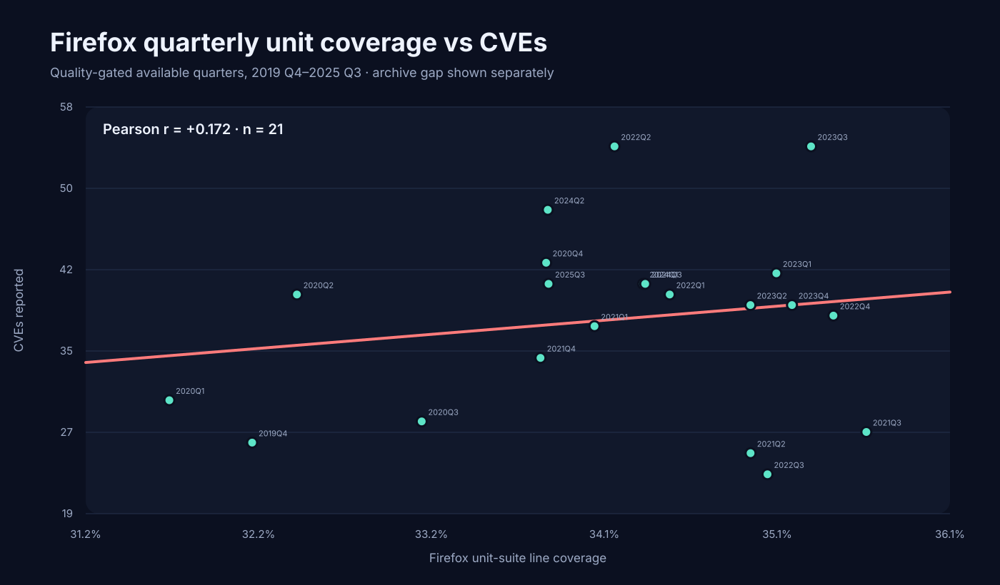
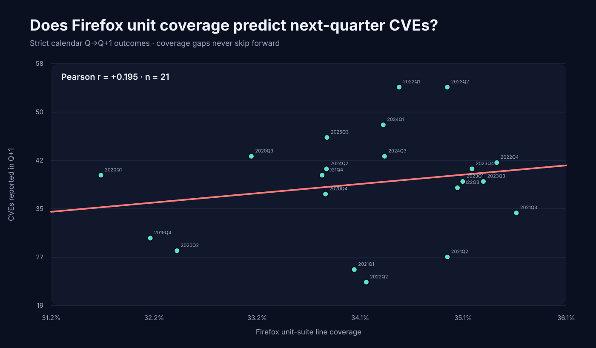
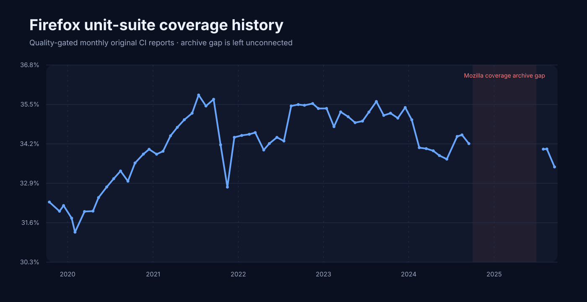
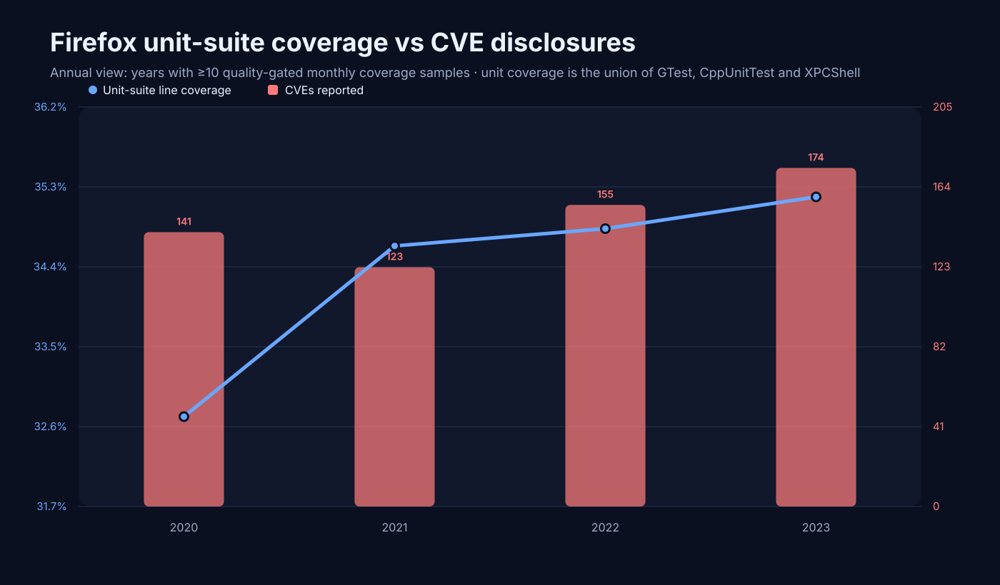

# Firefox results

This is the quality-gated Firefox replication of the Chromium study. It uses Mozilla's original public `mozilla-central` coverage archive and Mozilla's Firefox security advisories.

## Coverage metric

For each month, Testy considers up to five original revisions containing `all:gtest`, `all:cppunittest`, `all:xpcshell`, and `all:all`. Candidates are ranked by robust within-month compressed-report size and checked for plausible full-report metadata. The metric is the **union of exact source lines covered by GTest + CppUnitTest + XPCShell**, divided by the same-revision `all:all` executable-line denominator. Candidate attempts and rejection reasons are retained in `data/firefox/raw/coverage_quality_audit.csv`.

## Primary result

The exposure window is **2019 Q4 through 2025 Q3**, but Mozilla's archive has no usable coverage from **2024 Q4 through 2025 Q2**. Those quarters are missing rather than interpolated.

Across **21 available quality-gated quarters**, same-quarter Firefox unit-suite coverage vs CVEs has Pearson **r = +0.172** (naive IID bootstrap 95% CI -0.311 to +0.591) and Spearman **rho = +0.044**.

For the lagged analysis, each coverage quarter Q is matched to the **actual calendar Q+1**, even when Q+1 has no coverage measurement. Coverage in Q versus CVEs first disclosed in Q+1 has Pearson **r = +0.195** across **21 quarter pairs** (naive IID bootstrap 95% CI -0.154 to +0.499); Spearman **rho = +0.090**.

These are observational associations, not causal estimates.

## Data-quality boundaries

- Original coverage archive begins in September 2019.
- **2024-10 through 2025-06:** no usable complete unit-suite coverage revisions exist. Linux-specific streams have the same gap.
- Predictor coverage stops at **2025-09-30**. Q4 2025 CVEs remain usable as the outcome for Q3 coverage without treating late-2025 coverage as comparable.
- Missing primary quarters: **2024Q4, 2025Q1, 2025Q2**.
- Isolated selected months rejected by longitudinal denominator checking: **none**.
- Candidate report attempts rejected by static quality gates: **0**.

No missing coverage is interpolated, and lagging never jumps across a coverage gap.

## Annual descriptive data

Only years with at least 10 quality-gated monthly coverage samples are shown.

| Year | Mean unit-suite coverage | Unique Firefox CVEs | Coverage months |
| --- | ---: | ---: | ---: |
| 2020 | 32.73% | 141 | 12 |
| 2021 | 34.63% | 123 | 12 |
| 2022 | 34.82% | 155 | 12 |
| 2023 | 35.17% | 174 | 12 |

## Dataset

- Selected monthly original-CI samples: **74**, from **2019-09** through **2026-08**.
- Quality-eligible selected samples: **74**.
- Primary quality-eligible exposure samples through 2025 Q3: **63**.
- Same-period Firefox CVEs through 2025 Q3: **921**.
- Lag outcomes are allowed through 2025 Q4.

## Sources

- Historical raw coverage: `gs://relman-code-coverage-prod/mozilla-central`
- Mozilla coverage documentation: https://firefox-source-docs.mozilla.org/tools/code-coverage/index.html
- Firefox advisories: https://www.mozilla.org/en-US/security/known-vulnerabilities/firefox/
- GTest documentation: https://firefox-source-docs.mozilla.org/gtest/index.html
- XPCShell documentation: https://firefox-source-docs.mozilla.org/testing/xpcshell/index.html
- Taskcluster unit-test metadata: https://firefox-source-docs.mozilla.org/taskcluster/attributes.html

## Interpretation limits

1. CVEs measure discovered/disclosed vulnerabilities, not latent vulnerabilities.
2. The metric covers three long-running unit-oriented suites, not every Mozilla test that could be called a unit test.
3. The same-revision `all:all` denominator can change when instrumentation/build scope changes; late-2025 predictor data is therefore not mixed into the primary exposure series.
4. Coverage-report upload time is the sample timestamp rather than Mercurial commit time.
5. The IID bootstrap does not account for time-series autocorrelation.
6. Coverage can co-move with code churn, fuzzing, sanitizers, architecture changes, researcher attention, and other security work.
