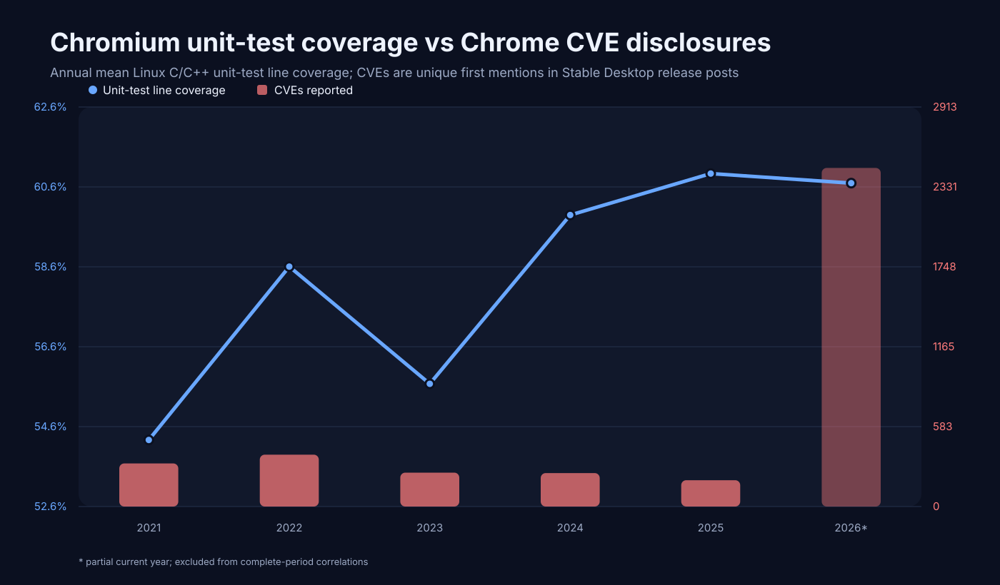
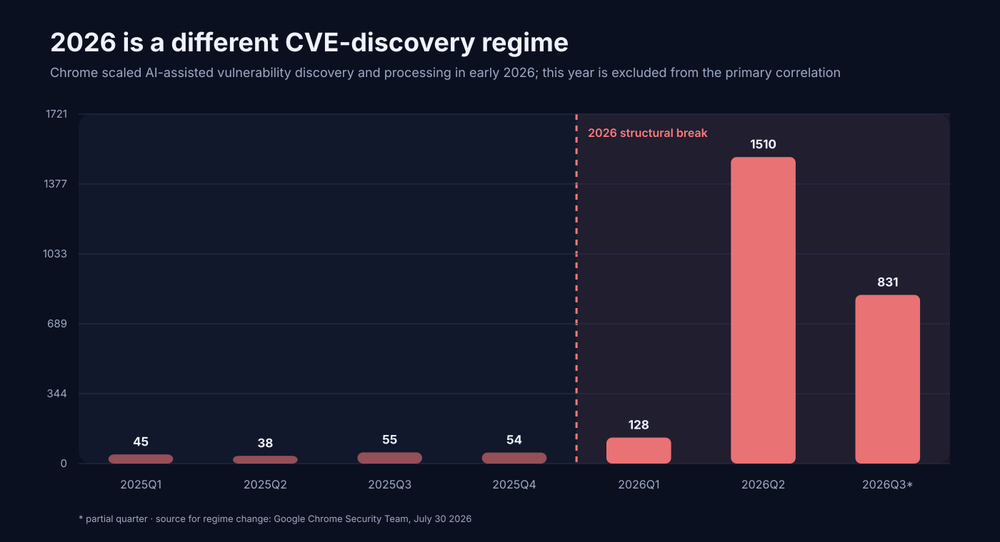

# Testy

A reproducible observational study of whether Chromium unit-test coverage is associated with later Chrome CVE disclosures.

**Primary study window: 2021–2025.** 2021 is the first year Chromium generated separate Linux C/C++ unit-only coverage; 2026 is kept in the raw/full-series datasets but excluded from the headline correlation because Chrome documented a major change in vulnerability discovery and processing in early 2026.



## Result

Using Chromium's official Linux C/C++ **Unit Tests Only** coverage reports and unique CVEs first disclosed in **Stable Channel Update for Desktop** posts:

- Same-quarter line coverage vs CVEs, 2021–2025: **Pearson r = -0.279**, Spearman **rho = -0.505** across 20 quarters.
- Coverage in quarter Q vs CVEs in Q+1, with both quarters inside 2021–2025: **Pearson r = -0.448**, Spearman **rho = -0.523** across 19 pairs.
- These are observational associations, not causal estimates.

See [RESULTS.md](RESULTS.md) for the charts, intervals and limitations.

## Why start at 2021?

Chromium's coverage infrastructure is older, but the metric used here is not. On **27 January 2021**, Chromium landed a commit literally titled **“generate unit test coverage for linux”**, adding `coverage_test_types = ["overall", "unit"]` to the Linux coverage builder. Before that, Linux coverage was an aggregate all-tests stream rather than a separate unit-only measurement.

Upstream commit: https://github.com/chromium/chromium/commit/61fe0e40252fdf2475926e560f722b558f14e5e4

Our downloaded `Unit Tests Only` history begins on the same date. Pre-2021 aggregate coverage cannot be spliced into this series without changing the independent variable halfway through the experiment. See [HISTORICAL_DATA.md](HISTORICAL_DATA.md) for the audit.

## Why stop at 2025?

In July 2026, Google's Chrome Security Team documented that it built a Gemini-based vulnerability-finding harness across the broader Chrome codebase in **early 2026**. By March it was receiving more security bug reports than in all of 2025, and Chrome 149 plus 150 fixed **1,072 security bugs**, more than the prior 23 milestones combined.

Source: https://blog.google/security/chrome-stronger-with-every-update/

That is a structural break in the process producing the CVE count. Mixing 2026 into the primary regression would compare periods with materially different vulnerability-discovery regimes. The cutoff is explicitly post-hoc: the initial analysis exposed the discontinuity, we investigated it, and then separated 2026 rather than silently deleting it.



## Reproduce

```bash
python -m venv .venv
. .venv/bin/activate
pip install -r requirements.txt
python study.py all
```

Or rerun stages independently:

```bash
python study.py collect
python study.py analyze
python study.py charts
```

`collect` always downloads the latest available data, including 2026+. `analyze` writes the 2021–2025 primary files plus `*_all.csv` full-series diagnostics.

## Data

- `data/raw/chromium_unit_coverage_daily.csv` — official unit-test coverage reports.
- `data/raw/chrome_stable_desktop_cves.csv` — unique CVEs at first Stable Desktop disclosure.
- `data/processed/annual.csv`, `quarterly.csv`, `monthly.csv` — **primary 2021–2025** datasets.
- `data/processed/quarterly_lag1.csv` — primary Q → Q+1 dataset, entirely within 2021–2025.
- `data/processed/*_all.csv` — retained full series including 2026.
- `data/processed/stats.json` — primary statistics plus full-series diagnostics.

## Sources

- Chromium coverage dashboard: https://analysis.chromium.org/coverage/p/chromium
- Chromium coverage documentation: https://chromium.googlesource.com/chromium/src/+/HEAD/docs/testing/code_coverage.md
- Linux unit-only coverage launch: https://github.com/chromium/chromium/commit/61fe0e40252fdf2475926e560f722b558f14e5e4
- Chrome Releases: https://chromereleases.googleblog.com/
- 2026 discovery-regime change: https://blog.google/security/chrome-stronger-with-every-update/
