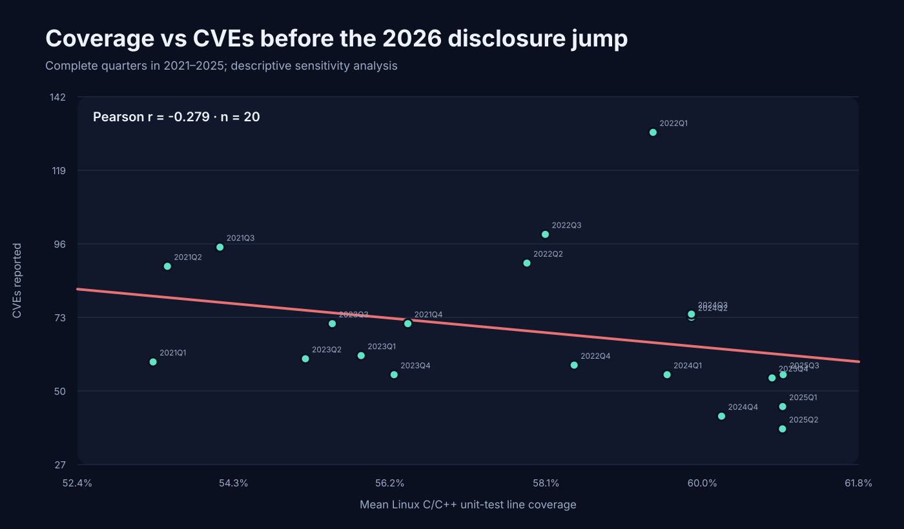
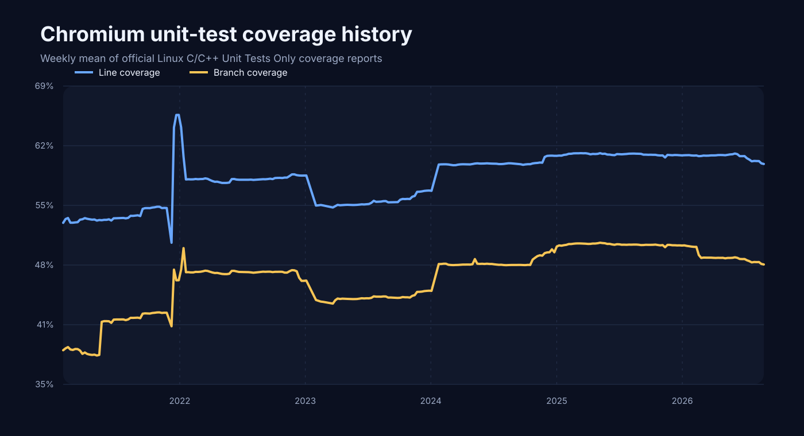

# Results

This is a descriptive observational study of Chromium's official Linux C/C++ **Unit Tests Only** coverage reports and CVEs first disclosed in Google Chrome **Stable Channel Update for Desktop** posts.

## Current result

Across 22 complete quarters, same-quarter unit-test **line coverage vs CVE count** has Pearson **r = +0.221** (bootstrap 95% CI -0.467 to +0.441); Spearman rho = -0.278.

For unit-test **branch coverage**, same-quarter Pearson r = +0.140.

Using coverage in quarter Q to predict CVEs first disclosed in Q+1 gives Pearson **r = +0.223** across 21 quarter pairs (bootstrap 95% CI -0.554 to +0.458).

### 2026 disclosure-regime sensitivity

Chrome's 2026 Stable Desktop posts contain an abrupt, order-of-magnitude rise in CVEs/security fixes in several releases. Because coverage did not move comparably, those two complete 2026 quarters have very high leverage on Pearson correlation. Restricting the comparable baseline to **2021–2025** changes same-quarter line-coverage Pearson r to **-0.279** (naive bootstrap 95% CI -0.715 to +0.122; Spearman rho **-0.505**) across 20 quarters. Coverage in Q vs CVEs in Q+1 becomes **r = -0.448** (naive bootstrap 95% CI -0.727 to -0.126) across 19 pairs.

This sensitivity result is more consistent with the hypothesis that more unit-test coverage accompanies fewer CVE disclosures, but the design is observational. The bootstrap is an IID quarter resample and therefore does not fully account for time-series autocorrelation; it should not be interpreted as causal evidence.

These correlations **do not establish that unit testing causes or prevents vulnerabilities**. Coverage changes with code composition and test selection; CVE disclosure depends on vulnerability discovery, researcher attention, release timing, fuzzing, sanitizers, code churn, third-party dependencies, and many other factors.

## Annual data

| Year | Mean line coverage | Mean branch coverage | Unique CVEs first reported |
| --- | ---: | ---: | ---: |
| 2021 | 54.22% | 40.88% | 314 |
| 2022 | 58.57% | 47.58% | 378 |
| 2023 | 55.63% | 44.64% | 247 |
| 2024 | 59.86% | 48.56% | 244 |
| 2025 | 60.90% | 50.62% | 192 |
| 2026 (partial) | 60.66% | 49.26% | 2469 |

## Dataset scope

- Coverage reports in overlap: **2,121**, from **2021-01-27** through **2026-08-27**.
- Unique Stable Desktop CVEs in overlap: **3,844**, from **2021-02-02** through **2026-08-25**.
- Coverage source: https://analysis.chromium.org/coverage/p/chromium
- CVE source: https://chromereleases.googleblog.com/
- Chromium coverage documentation: https://chromium.googlesource.com/chromium/src/+/HEAD/docs/testing/code_coverage.md

## Interpretation limits

1. The dependent variable is **reported CVEs**, not latent vulnerabilities. More scrutiny can create more CVE disclosures even if underlying security improves.
2. Chrome Stable Desktop advisories are the authoritative disclosure source used here, but some listed CVEs can reside in third-party code shipped by Chrome rather than Chromium-owned code.
3. The official dashboard's `Unit Tests Only` coverage is much closer to the research question than aggregate test coverage, but it is still a generated Linux C/C++ coverage corpus rather than a statement that every unit test in every platform ran successfully.
4. Same-period correlation has reverse-causality risk. The Q→Q+1 analysis reduces that problem but does not remove confounding.
5. A stronger follow-up would map each CVE to its introducing/fixing Chromium component and compare component-level historical coverage while controlling for LOC, churn, contributors, fuzzing, and component exposure.
