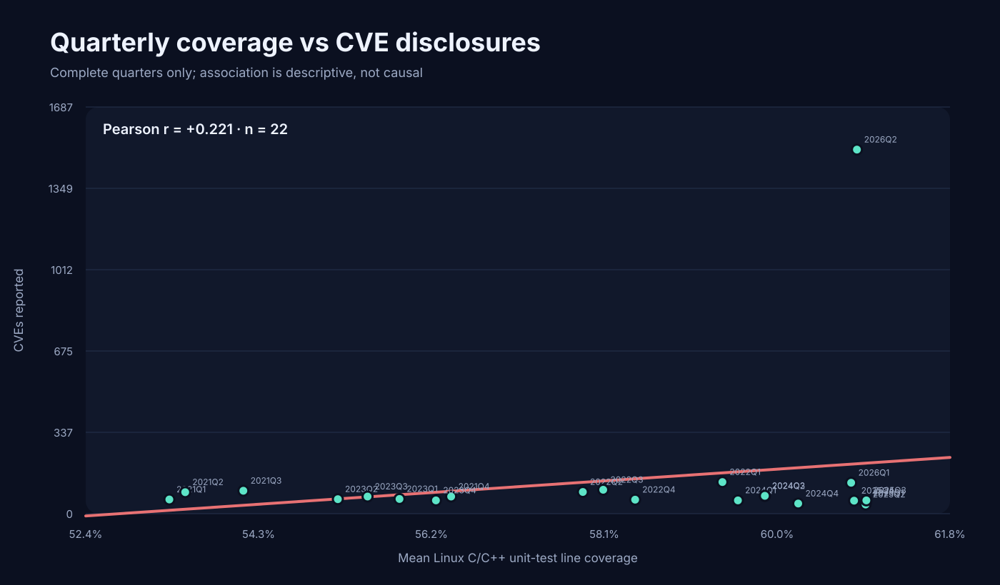
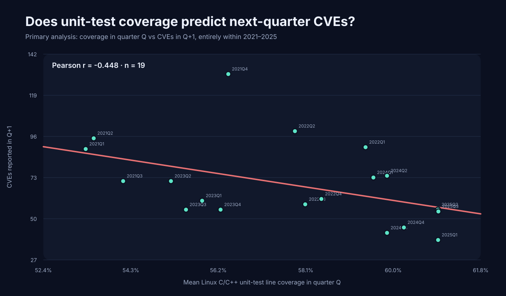

# Results

The primary study window is **2021–2025**. Chromium's 2026 data remains downloaded and reproducible, but it is excluded from the headline correlation because Chrome documented a major change in vulnerability discovery and processing in early 2026.

## Primary result: 2021–2025

Across **20 complete quarters**, same-quarter unit-test **line coverage vs reported CVEs** has Pearson **r = -0.279** (naive bootstrap 95% CI **-0.715 to +0.122**) and Spearman **rho = -0.505**.

Unit-test **branch coverage vs reported CVEs** has Pearson **r = -0.276**.

Coverage in quarter Q versus CVEs first disclosed in **Q+1**, with both quarters restricted to 2021–2025, has Pearson **r = -0.448** across **19 quarter pairs** (naive bootstrap 95% CI **-0.727 to -0.126**) and Spearman **rho = -0.523**.

These are observational associations, not causal estimates. The bootstrap is an IID quarter resample and does not fully account for time-series autocorrelation.

## Why 2026 is separate

Google's Chrome Security Team says it built a Gemini-based vulnerability-finding harness across the broader Chrome codebase in **early 2026**. By March, Chrome was receiving more bug reports than it had in all of 2025, and Chrome 149 plus 150 fixed **1,072 security bugs**, more than the prior 23 milestones combined.

Source: https://blog.google/security/chrome-stronger-with-every-update/

That is a documented structural break in the process generating the dependent variable: the rate at which vulnerabilities are found, processed, fixed and disclosed changed sharply. Including 2026 in the primary correlation would mix two different discovery regimes.

Our downloaded Stable Desktop data makes the discontinuity obvious:

| Quarter | CVEs first disclosed |
| --- | ---: |
| 2025 Q1 | 45 |
| 2025 Q2 | 38 |
| 2025 Q3 | 55 |
| 2025 Q4 | 54 |
| 2026 Q1 | 128 |
| 2026 Q2 | 1,510 |
| 2026 Q3* | 831 |

\* partial quarter in the current snapshot.

The raw and `*_all.csv` datasets retain 2026 so the exclusion is transparent and reversible. The cutoff was chosen **after the initial analysis revealed the discontinuity**, so this is explicitly a post-hoc comparability decision rather than a preregistered exclusion.

For reference, blindly including the two complete 2026 quarters flips the same-quarter Pearson correlation from **-0.279** to **+0.221** even though unit-test coverage barely changes. That is why the full series is retained as a diagnostic rather than used as the headline estimate.

## Annual primary data

| Year | Mean line coverage | Mean branch coverage | Unique CVEs first reported |
| --- | ---: | ---: | ---: |
| 2021 | 54.22% | 40.88% | 314 |
| 2022 | 58.57% | 47.58% | 378 |
| 2023 | 55.63% | 44.64% | 247 |
| 2024 | 59.86% | 48.56% | 244 |
| 2025 | 60.90% | 50.62% | 192 |

## Sources

- Chromium coverage dashboard: https://analysis.chromium.org/coverage/p/chromium
- Chromium coverage methodology: https://chromium.googlesource.com/chromium/src/+/HEAD/docs/testing/code_coverage.md
- Chrome Stable Desktop disclosures: https://chromereleases.googleblog.com/
- Google's explanation of the 2026 AI vulnerability-discovery change: https://blog.google/security/chrome-stronger-with-every-update/

## Interpretation limits

1. CVEs measure discovered and disclosed vulnerabilities, not latent vulnerability prevalence.
2. Chrome Stable Desktop posts can include third-party code shipped with Chrome.
3. Coverage is Linux C/C++ `Unit Tests Only` coverage, not every test on every Chrome platform.
4. The IID bootstrap does not account for time-series autocorrelation.
5. Coverage, CVEs, code churn, fuzzing, sanitizers, researcher attention and architectural hardening can move together.
6. A stronger next stage would map CVEs to Chromium components and compare component-level historical coverage while controlling for LOC, churn, contributors, fuzzing and exposure.
